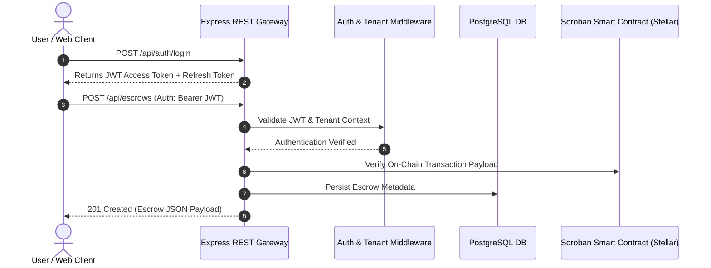

# Comprehensive REST API Reference

Welcome to the official REST API reference for **TrustHood Escrow**. This document provides exhaustive technical documentation for developers, system integrators, operators, and end users interacting with the backend services of TrustHood Escrow.

---

## Table of Contents

1. [Overview & Architecture](#overview--architecture)
2. [Authentication & Authorization](#authentication--authorization)
3. [Global Standards & Conventions](#global-standards--conventions)
   - [Base URLs](#base-urls)
   - [Request & Response Headers](#request--response-headers)
   - [Pagination Envelope](#pagination-envelope)
   - [Standard Error Envelope](#standard-error-envelope)
   - [Rate Limiting](#rate-limiting)
4. [API Endpoints Reference](#api-endpoints-reference)
   - [Authentication (`/api/auth`)](#authentication-apiauth)
   - [Escrows (`/api/escrows`)](#escrows-apiescrows)
   - [Disputes (`/api/disputes`)](#disputes-apidisputes)
   - [Users & Profiles (`/api/users`)](#users--profiles-apiusers)
   - [Reputation (`/api/reputation`)](#reputation-apireputation)
   - [Payments (`/api/payments`)](#payments-apipayments)
   - [KYC & Compliance (`/api/kyc`, `/api/compliance`)](#kyc--compliance-apikyc-apicompliance)
   - [Events & Indexing (`/api/events`)](#events--indexing-apievents)
   - [Search (`/api/search`)](#search-apisearch)
   - [Relayer Service (`/api/relayer`)](#relayer-service-apirelayer)
   - [Notifications (`/api/notifications`)](#notifications-apinotifications)
   - [Audit Logs (`/api/audit`)](#audit-logs-apiaudit)
   - [Admin Control (`/api/admin`)](#admin-control-apiadmin)
   - [System Health (`/health`)](#system-health-health)
5. [Webhooks & Realtime Subscriptions](#webhooks--realtime-subscriptions)
6. [Code Integration Examples](#code-integration-examples)
7. [Cross-References & Resources](#cross-references--resources)

---

## Overview & Architecture

The TrustHood Escrow REST API acts as the primary off-chain integration layer connecting user-facing applications (Web & Mobile) with the underlying Soroban Smart Contracts deployed on the Stellar network.



---

## Authentication & Authorization

The API supports three distinct authentication and authorization schemes depending on the endpoint scope:

### 1. JWT Bearer Token (User Authentication)
For standard user endpoints (e.g., managing escrows, uploading evidence, checking notifications):
```http
Authorization: Bearer <access_token>
```
- **Access Tokens**: Short-lived JWTs (valid for 15 minutes).
- **Refresh Tokens**: Long-lived secure HTTP-only cookies or request body payload used with `POST /api/auth/refresh`.

### 2. Admin API Key (Operator / System Scope)
Administrative endpoints (e.g., tenant administration, system metrics, manual event re-indexing) require an API key header:
```http
x-admin-api-key: <your_admin_api_key>
```

### 3. Webhook Signature Verification
Incoming webhooks sent by external integrations or emitted to subscribers are signed using HMAC-SHA256:
```http
x-signature-sha256: t=1700000000,v1=9f86d081884c7d659a2feaa0c55ad015a3bf4f1b2b0b822cd15d6c15b0f00a08
```

---

## Global Standards & Conventions

### Base URLs

| Environment | Base URL | Interactive OpenAPI Swagger UI |
| :--- | :--- | :--- |
| **Local Development** | `http://localhost:4000` | [`http://localhost:4000/api/docs`](http://localhost:4000/api/docs) |
| **Staging Environment** | `https://staging-api.trustchain.example.com` | `https://staging-api.trustchain.example.com/api/docs` |
| **Production Environment** | `https://api.trustchain.example.com` | `https://api.trustchain.example.com/api/docs` |

> The raw OpenAPI 3.0 specification is available at GET `/api/docs/json`.

### Request & Response Headers

Standard request headers:
- `Content-Type: application/json`
- `Accept: application/json`
- `x-tenant-id`: (Optional) Specify tenant organization context for multi-tenant environments.
- `x-correlation-id`: (Optional) Tracing identifier for distributed request logs.

### Pagination Envelope

Collection endpoints support page-based pagination. Accept query parameters `page` (default: 1) and `limit` (default: 20, max: 100).

```json
{
  "data": [
    {
      "id": "esc_987654321",
      "status": "ACTIVE",
      "amount": "500.0000000"
    }
  ],
  "page": 1,
  "limit": 20,
  "total": 42,
  "totalPages": 3,
  "hasNextPage": true,
  "hasPreviousPage": false
}
```

### Standard Error Envelope

All API errors return appropriate HTTP status codes alongside a consistent JSON payload:

```json
{
  "error": "Detailed description of the error encountered.",
  "code": "INVALID_MILESTONE_STATUS",
  "details": [
    {
      "field": "amount",
      "message": "Amount must be a positive number greater than 0"
    }
  ]
}
```

#### Standard HTTP Status Codes

| Status Code | Meaning | Description |
| :--- | :--- | :--- |
| `200 OK` | Success | Request succeeded. |
| `201 Created` | Resource Created | Entity successfully created. |
| `400 Bad Request` | Validation Error | Malformed JSON or invalid query/body params. |
| `401 Unauthorized` | Unauthenticated | Missing or expired JWT token. |
| `403 Forbidden` | Access Denied | Insufficient permissions or resource ownership failure. |
| `404 Not Found` | Resource Missing | Specified resource or endpoint does not exist. |
| `422 Unprocessable Entity` | Business Rule Failure | Invariant failure (e.g. approving an already released milestone). |
| `429 Too Many Requests` | Rate Limit Exceeded | Request quota exceeded for time window. |
| `500 Internal Error` | Server Exception | Unhandled internal server error. |

### Rate Limiting

| Scope | Window | Request Limit | Headers Returned |
| :--- | :--- | :--- | :--- |
| General API Endpoints | 1 Minute | 60 requests | `X-RateLimit-Limit`, `X-RateLimit-Remaining`, `X-RateLimit-Reset` |
| Auth Endpoints (`/api/auth/*`) | 15 Minutes | 10 requests | `X-RateLimit-Limit`, `X-RateLimit-Remaining` |
| Leaderboard (`/api/reputation/leaderboard`) | 1 Minute | 30 requests | `X-RateLimit-Limit`, `X-RateLimit-Remaining` |

---

## API Endpoints Reference

### Authentication (`/api/auth`)

#### `POST /api/auth/register`
Register a new user profile with email and password.

- **Auth Required**: None (Public)
- **Request Body**:
  ```json
  {
    "email": "user@example.com",
    "password": "SecurePassword123!",
    "walletAddress": "GBCX..."
  }
  ```
- **Response `201 Created`**:
  ```json
  {
    "message": "User registered successfully",
    "user": {
      "id": "usr_12345",
      "email": "user@example.com",
      "walletAddress": "GBCX..."
    }
  }
  ```

#### `POST /api/auth/login`
Authenticate user credentials and return access JWT + refresh token.

- **Auth Required**: None (Public)
- **Request Body**:
  ```json
  {
    "email": "user@example.com",
    "password": "SecurePassword123!"
  }
  ```
- **Response `200 OK`**:
  ```json
  {
    "accessToken": "eyJhbGciOi...",
    "refreshToken": "d8f7e6...",
    "expiresIn": 900,
    "user": {
      "id": "usr_12345",
      "email": "user@example.com"
    }
  }
  ```

#### `POST /api/auth/refresh`
Exchange a valid refresh token for a new 15-minute access token.

- **Auth Required**: None (Public with valid refresh token)
- **Request Body**:
  ```json
  {
    "refreshToken": "d8f7e6..."
  }
  ```

---

### Escrows (`/api/escrows`)

#### `GET /api/escrows`
Retrieve list of escrows for authenticated user or filtered by status.

- **Auth Required**: Bearer JWT
- **Query Parameters**:
  - `page` (integer, default: 1)
  - `limit` (integer, default: 20)
  - `status` (string: `ACTIVE`, `COMPLETED`, `DISPUTED`, `CANCELLED`)
  - `role` (string: `client`, `freelancer`, `arbiter`)
- **Response `200 OK`**:
  ```json
  {
    "data": [
      {
        "id": "1",
        "contractEscrowId": 1,
        "clientAddress": "GAAA...",
        "freelancerAddress": "GBBB...",
        "tokenAddress": "CDLZ...",
        "totalAmount": "1000.0000000",
        "status": "ACTIVE",
        "milestonesCount": 3,
        "approvedCount": 1,
        "createdAt": "2026-03-20T10:00:00Z"
      }
    ],
    "page": 1,
    "limit": 20,
    "total": 1,
    "totalPages": 1
  }
  ```

#### `POST /api/escrows`
Record a newly created on-chain escrow contract in off-chain database.

- **Auth Required**: Bearer JWT
- **Request Body**:
  ```json
  {
    "escrowId": 1,
    "clientAddress": "GAAA...",
    "freelancerAddress": "GBBB...",
    "tokenAddress": "CDLZ...",
    "totalAmount": "1000.0000000",
    "title": "Web Application Development",
    "description": "Full-stack Web3 application building on Stellar Soroban",
    "arbiterAddress": "GCCC...",
    "milestones": [
      {
        "milestoneId": 1,
        "title": "UI Wireframes & Architecture",
        "amount": "300.0000000"
      },
      {
        "milestoneId": 2,
        "title": "Smart Contract & API Integration",
        "amount": "700.0000000"
      }
    ]
  }
  ```

#### `GET /api/escrows/:id`
Get full escrow detail including milestones, event timeline, and evidence.

- **Auth Required**: Bearer JWT

#### `POST /api/escrows/:id/release`
Approve and record milestone release transaction.

- **Auth Required**: Bearer JWT (Client only)
- **Request Body**:
  ```json
  {
    "milestoneId": 1,
    "transactionHash": "a1b2c3d4..."
  }
  ```

---

### Disputes (`/api/disputes`)

#### `GET /api/disputes`
List disputes requiring arbiter attention or involving caller.

- **Auth Required**: Bearer JWT
- **Query Params**: `status` (`OPEN`, `RESOLVED`, `ESCALATED`)

#### `POST /api/disputes`
Raise a dispute for a specific escrow milestone and attach IPFS evidence hash.

- **Auth Required**: Bearer JWT
- **Request Body**:
  ```json
  {
    "escrowId": 1,
    "milestoneId": 2,
    "reason": "Deliverable failed to meet specified acceptance criteria.",
    "evidenceIpfsHash": "QmXoypizjW3WknFiJnKLwHCnL72vedxjQkDDP1mXWo6uco"
  }
  ```

#### `POST /api/disputes/:id/resolve`
Submit arbiter ruling resolving dispute and allocating funds percentage.

- **Auth Required**: Bearer JWT (Designated Arbiter only)
- **Request Body**:
  ```json
  {
    "clientShareBps": 6000,
    "freelancerShareBps": 4000,
    "rulingReason": "Partial completion verified; 60% refund to client.",
    "transactionHash": "e5f6g7h8..."
  }
  ```

---

### Users & Profiles (`/api/users`)

#### `GET /api/users/me`
Fetch caller profile details, wallet linkages, and account configuration.

- **Auth Required**: Bearer JWT

#### `GET /api/users/:address/stats`
Get publicly available metrics for a given Stellar wallet address.

- **Auth Required**: None (Public)
- **Response `200 OK`**:
  ```json
  {
    "address": "GAAA...",
    "escrowsCreated": 12,
    "escrowsCompleted": 11,
    "totalVolumeUsd": "45200.00",
    "disputeCount": 1,
    "reputationScore": 850
  }
  ```

---

### Reputation (`/api/reputation`)

#### `GET /api/reputation/leaderboard`
Retrieve global reputation leaderboard ranking top participants.

- **Auth Required**: None (Public, Rate Limited to 30 req/min)
- **Query Params**: `page`, `limit`, `role` (`client`, `freelancer`, `arbiter`)

#### `GET /api/reputation/:address`
Get detailed breakdown of reputation points, slash records, and completion streak.

---

### Payments (`/api/payments`)

#### `GET /api/payments/history`
Query user's payment audit history across escrows, fees, and refunds.

#### `POST /api/payments/quote-fee`
Calculate protocol fee percentage and platform surcharge for an escrow volume.

---

### KYC & Compliance (`/api/kyc`, `/api/compliance`)

#### `GET /api/kyc/status`
Check account identity verification level (`UNVERIFIED`, `TIER_1`, `TIER_2`).

#### `POST /api/kyc/submit`
Submit user verification metadata for compliance screening.

---

### Events & Indexing (`/api/events`)

#### `GET /api/events`
Fetch indexed Stellar Soroban contract events matching filter parameters.

- **Query Params**: `contractId`, `eventType`, `fromLedger`, `toLedger`

---

### Search (`/api/search`)

#### `GET /api/search`
Perform full-text search across escrows, proposals, and user profiles.

---

### Relayer Service (`/api/relayer`)

#### `POST /api/relayer/estimate-fee`
Estimate network gas and relayer execution fee for gasless transactions.

#### `POST /api/relayer/submit`
Submit meta-transaction payload for relayer execution on Stellar network.

---

### Notifications (`/api/notifications`)

#### `GET /api/notifications`
Fetch unread user notifications.

#### `POST /api/notifications/preferences`
Update notification channels (Email, Webhook, In-App).

---

### Audit Logs (`/api/audit`)

#### `GET /api/audit/logs`
Retrieve administrative system audit logs.

- **Auth Required**: `x-admin-api-key`

---

### Admin Control (`/api/admin`)

#### `GET /api/admin/metrics`
Retrieve system-wide operational metrics (active escrows, total volume, indexer delay).

- **Auth Required**: `x-admin-api-key`

---

### System Health (`/health`)

#### `GET /health`
Liveness and readiness check endpoint.

- **Auth Required**: None (Public)
- **Response `200 OK`**:
  ```json
  {
    "status": "UP",
    "timestamp": "2026-07-26T09:00:00.000Z",
    "services": {
      "database": "CONNECTED",
      "redis": "CONNECTED",
      "stellarRpc": "HEALTHY",
      "indexerDelayLedgers": 0
    }
  }
  ```

---

## Webhooks & Realtime Subscriptions

Subscribers can receive HTTP `POST` callbacks for on-chain events.

### Webhook Event Payload Schema

```json
{
  "eventId": "evt_998877",
  "eventType": "ESCROW_CREATED",
  "timestamp": 1700000000,
  "data": {
    "escrowId": 1,
    "client": "GAAA...",
    "freelancer": "GBBB...",
    "amount": "1000.0000000"
  }
}
```

See [docs/webhooks.md](webhooks.md) for full subscription lifecycle, payload structures, signature verification, and retry schedules.

---

## Code Integration Examples

### cURL

```bash
# Authenticate and obtain JWT
curl -X POST http://localhost:4000/api/auth/login \
  -H "Content-Type: application/json" \
  -d '{"email":"dev@example.com","password":"SecretPassword123!"}'

# List active escrows
curl -X GET "http://localhost:4000/api/escrows?status=ACTIVE" \
  -H "Authorization: Bearer <your_access_token>"
```

### JavaScript / TypeScript

```typescript
import axios from 'axios';

const API_BASE_URL = 'http://localhost:4000/api';

async function fetchUserEscrows(accessToken: string) {
  const response = await axios.get(`${API_BASE_URL}/escrows`, {
    headers: {
      Authorization: `Bearer ${accessToken}`,
    },
    params: {
      status: 'ACTIVE',
      limit: 10,
    },
  });

  return response.data;
}
```

### Python

```python
import requests

API_BASE_URL = "http://localhost:4000/api"

def get_reputation_leaderboard():
    url = f"{API_BASE_URL}/reputation/leaderboard"
    response = requests.get(url, params={"page": 1, "limit": 10})
    response.raise_for_status()
    return response.json()
```

---

## Cross-References & Resources

- [Developer Onboarding Guide](developer-onboarding.md) — Local setup and development environment installation.
- [Smart Contract ABI & Entry Points Reference](smart-contract-abi.md) — Complete Soroban contract entry points.
- [Architecture Overview](architecture-overview.md) — Deep dive into system components and data flow.
- [Configuration Reference](configuration.md) — Exhaustive list of environment variables.
- [Webhooks Documentation](webhooks.md) — Webhook subscription and delivery payload specification.
- [Security Model & Threat Matrix](security-model.md) — Access control matrix and security invariants.
