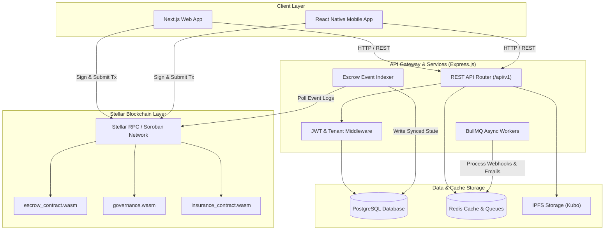
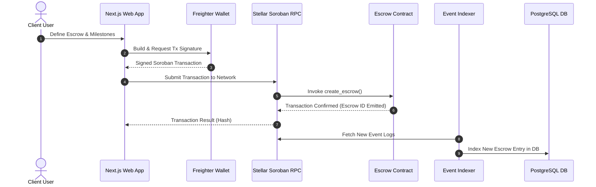
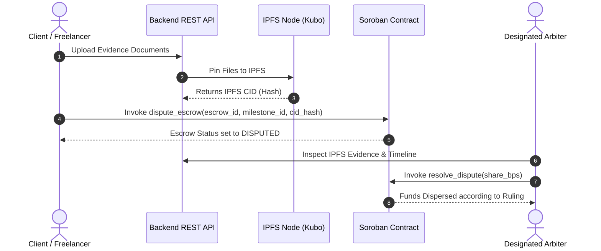

# System Architecture Overview

This document provides a comprehensive, high-level architecture overview of **TrustHood Escrow**, detailing all major system components, data flows, security boundaries, storage mechanisms, and scalability strategies.

---

## Table of Contents

1. [High-Level Architecture Diagram](#high-level-architecture-diagram)
2. [Core Subsystems & Component Responsibilities](#core-subsystems--component-responsibilities)
   - [User Client Applications (Frontend & Mobile)](#1-user-client-applications-frontend--mobile)
   - [REST API Gateway & Controllers](#2-rest-api-gateway--controllers)
   - [Stellar Soroban Smart Contracts](#3-stellar-soroban-smart-contracts)
   - [Escrow Event Indexer & Background Workers](#4-escrow-event-indexer--background-workers)
   - [Data Storage & Cache Infrastructure](#5-data-storage--cache-infrastructure)
   - [Decentralized Storage (IPFS)](#6-decentralized-storage-ipfs)
3. [End-to-End Data Flow Sequences](#end-to-end-data-flow-sequences)
   - [1. Escrow Creation & Funding Flow](#1-escrow-creation--funding-flow)
   - [2. Milestone Submission & Fund Release Flow](#2-milestone-submission--fund-release-flow)
   - [3. Dispute Resolution & Evidence Filing Flow](#3-dispute-resolution--evidence-filing-flow)
   - [4. Real-time Event Indexing & Webhook Dispatch](#4-real-time-event-indexing--webhook-dispatch)
4. [Security Architecture & Isolation Boundaries](#security-architecture--isolation-boundaries)
5. [Scalability & Reliability Design](#scalability--reliability-design)
6. [Cross-References](#cross-references)

---

## High-Level Architecture Diagram

---

## Core Subsystems & Component Responsibilities

### 1. User Client Applications (Frontend & Mobile)
- **Web App (`frontend/`)**: Modern Next.js application providing interactive escrow dashboards, milestone creation interfaces, dispute management screens, and real-time activity feeds.
- **Mobile App (`mobile/`)**: React Native mobile client for managing escrows on iOS and Android.
- **Wallet Integration**: Integrates directly with Stellar wallet extensions (Freighter, Albedo, Rango) to execute client-side transaction signing without exposing private keys to backend servers.

### 2. REST API Gateway & Controllers (`backend/api/`)
- Express.js Node.js server exposing structured endpoints for user profiles, escrow metadata indexing, dispute evidence upload, reputation tracking, and analytics.
- Enforces JWT authentication, multi-tenant isolation, rate limiting, and input schema validation.

### 3. Stellar Soroban Smart Contracts (`contracts/`)
- **`escrow_contract`**: Core business logic handling milestone funding, lock-time enforcement, dispute locks, partial cancellations, and fund releases.
- **`governance`**: Decentralized arbiter registry, reputation scoring calculations, dispute escalations, and arbiter stake slashing.
- **`insurance_contract`**: Yield-generating collateral pool providing buyer protection against non-delivery.
- **`escrow_extensions`**: Multi-signature approvals and automated recurring payment schedules.

### 4. Escrow Event Indexer & Background Workers (`backend/workers/`)
- **Event Indexer**: Continuous daemon polling Soroban contract RPC event topics (`EscrowCreated`, `MilestoneApproved`, `DisputeRaised`). Translates on-chain events into indexed relational tables in PostgreSQL.
- **BullMQ Workers**: Handles asynchronous job execution including sending transactional emails, processing IPFS evidence pin requests, and executing signed webhook HTTP callbacks.

### 5. Data Storage & Cache Infrastructure
- **PostgreSQL**: Primary transactional database storing user accounts, escrow metadata, dispute logs, indexed contract history, and audit trails.
- **Redis**: High-performance in-memory cache for API rate limiting, session token invalidation, leaderboard caching, and BullMQ queue message brokering.

### 6. Decentralized Storage (IPFS)
- Stores immutable job briefs, dispute evidence files, milestone deliverables, and audit documentation.
- Files are pinned to IPFS nodes (Kubo), producing cryptographic content identifiers (CIDs) recorded directly on-chain in smart contract state.

---

## End-to-End Data Flow Sequences

### 1. Escrow Creation & Funding Flow

### 2. Dispute Resolution & Evidence Filing Flow

---

## Security Architecture & Isolation Boundaries

1. **Client-Side Key Management**: Private keys are never transmitted over the network or stored in backend databases; all transactions are signed in browser wallets.
2. **On-Chain Authorization (`require_auth()`)**: Smart contract functions enforce strict Stellar address verification prior to state modifications.
3. **JWT Authentication & RBAC**: API endpoints validate short-lived JWT access tokens and restrict administrative actions to verified admin key holders.
4. **Multi-Tenant Context Scoping**: Database queries use strict tenant ID scoping (`x-tenant-id`) to prevent unauthorized cross-tenant data access.
5. **Rate Limiting Protection**: Redis-backed rate limiters shield API endpoints from distributed denial-of-service (DDoS) attacks.

---

## Scalability & Reliability Design

- **Granular Smart Contract Storage**: Uses separate persistent storage entries (`PackedDataKey::EscrowMeta`, `PackedDataKey::Milestone`) to bound storage costs and keep gas usage O(1) regardless of total escrow count.
- **Asynchronous Event Indexing**: Offloads blockchain polling and state synchronization to background indexers, ensuring sub-100ms API response times.
- **Database Read Replicas**: Allows read-heavy endpoint queries (escrow search, leaderboards) to scale horizontally without locking primary write databases.
- **Circuit Breakers & Retries**: External RPC calls and IPFS uploads utilize automatic retry mechanisms with exponential backoff and circuit breakers.

---

## Cross-References

- [Comprehensive REST API Reference](api-reference.md) — Exhaustive REST endpoint specifications.
- [Smart Contract ABI & Entry Point Reference](smart-contract-abi.md) — Soroban function signatures.
- [Developer Onboarding Guide](developer-onboarding.md) — Step-by-step local development setup.
- [Security Model & Threat Matrix](security-model.md) — Comprehensive threat model and security invariants.
