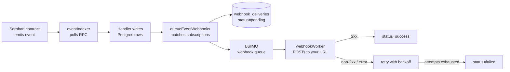
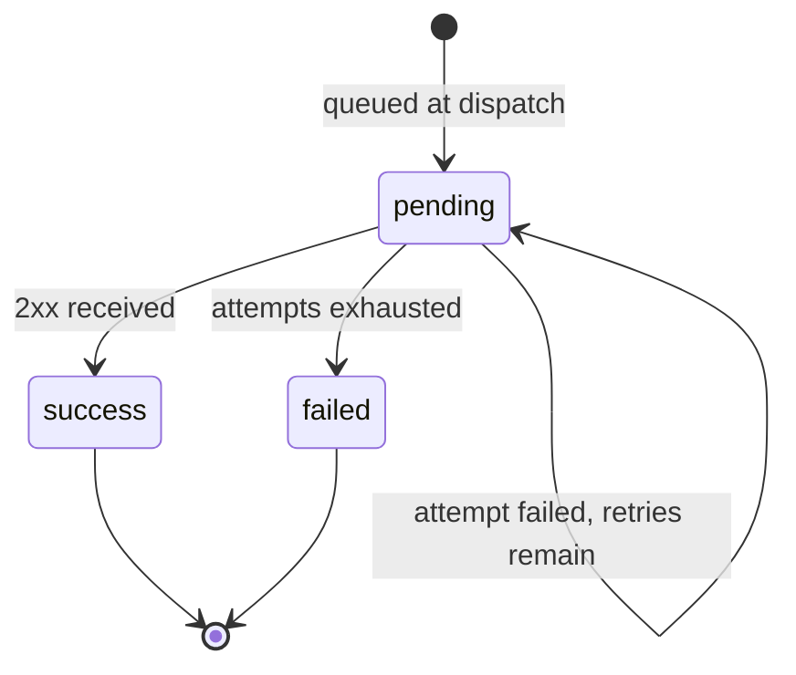

# Webhooks

TrustHood Escrow can push on-chain escrow activity to your server as signed HTTP
requests. Subscribe once, and every time the indexer confirms a matching contract
event you receive a `POST` with a JSON envelope describing what happened.

**Audience:** integrators building on the TrustHood Escrow API.

Related reading:

- [docs/event-schema.md](event-schema.md) — canonical on-chain event definitions (topic/data tuples, Rust emitters)
- [docs/indexer-guide.md](indexer-guide.md) — how contract events reach the database in the first place
- [docs/api-reference.md](api-reference.md) — authentication and the rest of the REST surface
- [docs/configuration.md](configuration.md) — every environment variable, including the `WEBHOOK_*` family
- [docs/error-codes.md](error-codes.md) — API error semantics

---

## Table of contents

- [How delivery works](#how-delivery-works)
- [Managing subscriptions](#managing-subscriptions)
- [The delivery envelope](#the-delivery-envelope)
- [Event types](#event-types)
- [Per-event payloads](#per-event-payloads)
- [Verifying signatures](#verifying-signatures)
- [Retries and failure handling](#retries-and-failure-handling)
- [Inspecting delivery history](#inspecting-delivery-history)
- [Configuration](#configuration)
- [Building a receiver](#building-a-receiver)
- [Troubleshooting](#troubleshooting)

---

## How delivery works

A webhook is the last hop of the indexing pipeline. Nothing is delivered until the
event has been read from the chain and committed to the database, so a webhook is
a statement about confirmed, indexed state — not a pending transaction.



Three properties follow from this design and are worth designing your receiver
around:

| Property                | What it means for you                                                                                                                            |
| ----------------------- | ------------------------------------------------------------------------------------------------------------------------------------------------ |
| **At-least-once**       | A delivery can arrive more than once (retry after your server accepted but timed out). De-duplicate on `deliveryId`.                              |
| **Not strictly ordered** | Deliveries for one escrow are queued in ledger order but retries can overtake fresh events. Use `ledger` and `eventIndex` to order, not arrival time. |
| **Post-commit**         | The database is already updated when the webhook fires, so it is safe to call the REST API for extra detail on receipt.                           |

The pipeline is fire-and-forget from the indexer's perspective: a webhook dispatch
failure is logged and never blocks or rolls back indexing
([eventIndexer.js:424](../backend/services/eventIndexer.js#L424)).

---

## Managing subscriptions

All subscription endpoints live under `/api/webhooks` and require a **Bearer JWT**
— the API gateway authenticates every `/api/*` route that is not explicitly public
([gateway/index.js](../backend/gateway/index.js)). Subscriptions are scoped to the
wallet address on the token: you only ever see and delete your own.

CSRF tokens are **not** required on these routes. The CSRF middleware exempts any
path containing `/webhook`, so a server-to-server client with only a bearer token
can manage subscriptions.

### Create a subscription

```http
POST /api/webhooks/subscribe
Authorization: Bearer <jwt>
Content-Type: application/json
```

```json
{
  "url": "https://api.example.com/hooks/trustchain",
  "eventTypes": ["esc_crt", "mil_apr", "funds_rel"]
}
```

Response `201 Created`:

```json
{
  "data": {
    "id": "clx7f0a2b0000qzrmn831i7rn",
    "url": "https://api.example.com/hooks/trustchain",
    "eventTypes": ["esc_crt", "mil_apr", "funds_rel"],
    "secret": "9f8c1d…",
    "createdAt": "2026-07-25T10:12:04.221Z",
    "updatedAt": "2026-07-25T10:12:04.221Z"
  }
}
```

> **The `secret` is returned exactly once, at creation.** It is never included in
> any later response. Store it in your secret manager before you close the
> connection; if you lose it, delete the subscription and create a new one.

Validation rules ([webhookController.js](../backend/api/controllers/webhookController.js)):

| Rule                                        | Failure response                                        |
| ------------------------------------------- | ------------------------------------------------------- |
| `url` must parse and use the `https:` scheme | `400 { "error": "url must be a valid HTTPS URL" }`      |
| `eventTypes` must be a non-empty array       | `400 { "error": "eventTypes must be a non-empty array" }` |
| `eventTypes` may hold at most 20 entries     | `400 { "error": "eventTypes may not exceed 20 entries" }` |

Plain `http://` is rejected outright — signatures protect integrity, not
confidentiality, and payloads carry escrow amounts and counterparty addresses.

**Rate limit:** 10 subscription creations per 10-minute sliding window, keyed on
your wallet address (falling back to IP for unauthenticated callers). Exceeding it
returns `429` with `Too many webhook subscription requests — try again later`.
Listing, deleting, and reading delivery history are subject only to the standard
gateway rate limit.

### List your subscriptions

```http
GET /api/webhooks
Authorization: Bearer <jwt>
```

```json
{
  "data": [
    {
      "id": "clx7f0a2b0000qzrmn831i7rn",
      "url": "https://api.example.com/hooks/trustchain",
      "eventTypes": ["esc_crt", "mil_apr", "funds_rel"],
      "isActive": true,
      "createdAt": "2026-07-25T10:12:04.221Z",
      "updatedAt": "2026-07-25T10:12:04.221Z"
    }
  ]
}
```

Newest first. Note the absence of `secret`.

### Delete a subscription

```http
DELETE /api/webhooks/:id
Authorization: Bearer <jwt>
```

Returns `204 No Content` on success, or `404 { "error": "Webhook subscription not found" }`
if the id does not exist **or** belongs to another account. Deleting a subscription
cascades to its delivery history.

There is no update endpoint. To change a URL or the event list, delete the
subscription and create a new one — which also rotates the signing secret.

---

## The delivery envelope

Every request is a `POST` with `Content-Type: application/json` and this envelope
([webhookService.js:13-20](../backend/services/webhookService.js#L13-L20)):

```json
{
  "eventType": "esc_crt",
  "deliveryId": "clx7f1m4k0001qzrm6c2h8w0p",
  "timestamp": "2026-07-25T10:14:58.902Z",
  "data": {
    "eventType": "esc_crt",
    "ledger": "1284471",
    "ledgerAt": "2026-07-25T10:14:55.000Z",
    "contractId": "CDLZFC3SYJYDZT7K67VZ75HPJVIEUVNIXF47ZG2FB2RMQQVU2HHGCYSC",
    "escrowId": "42",
    "topics": ["esc_crt", "42"],
    "data": ["GA7QYNF7…", "GBRPYHIL…", "10000000000"],
    "txHash": "b9d2f0c1a4…",
    "eventIndex": 0
  }
}
```

### Envelope fields

| Field        | Type   | Description                                                                             |
| ------------ | ------ | --------------------------------------------------------------------------------------- |
| `eventType`  | string | The event symbol that triggered this delivery — see [Event types](#event-types).         |
| `deliveryId` | string | Unique id for this delivery attempt chain. **Use this as your idempotency key.**         |
| `timestamp`  | string | ISO-8601 time the envelope was built (dispatch time, not ledger close time).             |
| `data`       | object | The indexed event, described below.                                                      |

### `data` fields

| Field        | Type             | Description                                                                                     |
| ------------ | ---------------- | ----------------------------------------------------------------------------------------------- |
| `eventType`  | string           | Same value as the envelope's `eventType`; duplicated for consumers that forward only `data`.     |
| `ledger`     | string           | Ledger sequence the event closed in. Sent as a string — ledger sequences exceed safe JSON ints.  |
| `ledgerAt`   | string           | ISO-8601 ledger close time. This is the authoritative "when did it happen".                      |
| `contractId` | string           | Contract that emitted the event.                                                                 |
| `escrowId`   | string \| null   | Escrow id from the event's second topic, or `null` for events with no escrow topic (`rep_upd`).  |
| `topics`     | array            | Decoded topic tuple, positionally as defined in [event-schema.md](event-schema.md).              |
| `data`       | array \| scalar  | Decoded data tuple, positionally as defined in [event-schema.md](event-schema.md).               |
| `txHash`     | string           | Transaction hash containing the event.                                                           |
| `eventIndex` | number           | Index of the event within its transaction. Combine with `ledger` for a total order.              |

> **Read `topics` and `data` positionally.** They mirror the contract's tuples
> exactly, so the position of each element is stable and documented, but the JSON
> encoding of individual scalars depends on how the Soroban RPC client decoded the
> `ScVal`. Treat amounts as strings and parse them with a big-integer type — escrow
> amounts are `i128` stroops and will overflow a JavaScript `Number`. Fields you can
> rely on being plain strings are `eventType`, `escrowId`, `ledger`, and `txHash`.

### Headers

| Header                  | Description                                                       |
| ----------------------- | ----------------------------------------------------------------- |
| `Content-Type`          | Always `application/json`.                                        |
| `X-Webhook-Signature`   | Hex-encoded HMAC-SHA256 of the request body. See [Verifying signatures](#verifying-signatures). |
| `X-Webhook-Delivery-Id` | Same value as the envelope's `deliveryId`.                        |
| `X-Webhook-Event-Type`  | Same value as the envelope's `eventType`, for cheap routing before parsing the body. |

---

## Event types

The escrow contract emits roughly forty distinct topics, but **only the eleven
events the indexer has a handler for are deliverable as webhooks.** Anything else is
logged as `indexer_unknown_event_type` and dispatch stops before the webhook step
([eventIndexer.js](../backend/services/eventIndexer.js)). Subscribing to a topic
outside this list is accepted by the API but will never deliver.

| `eventType` | Contract event      | Fires when                                                              | Indexer side-effect                       |
| ----------- | ------------------- | ----------------------------------------------------------------------- | ----------------------------------------- |
| `esc_crt`   | Escrow created      | An escrow is initialised and funds are locked                           | Inserts the escrow row                    |
| `mil_add`   | Milestone added     | A milestone is appended to an escrow                                    | Inserts the milestone row                 |
| `mil_sub`   | Milestone submitted | The freelancer submits work for a milestone                            | Milestone → `Submitted`                   |
| `mil_apr`   | Milestone approved  | The client approves a submission                                        | Milestone → `Approved`                    |
| `mil_rej`   | Milestone rejected  | The client rejects a submission                                         | Milestone → `Rejected`                    |
| `mil_dis`   | Milestone disputed  | A dispute is raised against a specific milestone                        | Milestone → `Rejected` (see note below)   |
| `funds_rel` | Funds released      | Funds move out of escrow to a recipient                                 | Decrements the escrow's remaining balance |
| `esc_can`   | Escrow cancelled    | An escrow is cancelled and the remainder returns to the client          | Escrow → `Cancelled`                      |
| `dis_rai`   | Dispute raised      | A dispute is opened on the escrow                                       | Escrow → `Disputed`, creates the dispute  |
| `dis_res`   | Dispute resolved    | An arbiter splits the funds and closes the dispute                      | Escrow → `Completed`, resolves the dispute |
| `rep_upd`   | Reputation updated  | A participant's on-chain reputation score changes                       | Upserts the reputation record             |

> **`mil_dis` note:** the database `MilestoneStatus` enum has no `Disputed` member,
> so a disputed milestone is stored as `Rejected`. The webhook still reports
> `mil_dis`, so the event is the reliable signal that a milestone was disputed
> rather than plainly rejected.

Contract events with no handler — and therefore no webhook — include `esc_done`,
`msig_apr`, the `rec_*` recurring-payment family, `vest_crt`, the `can_*`,
`slsh_*`, `tl_*`, and `lock_*` families, `arb_upd`, and `nft_gate`. See
[event-schema.md](event-schema.md) for the full on-chain catalogue; if you need one
of these, the indexer has to learn to handle it first.

---

## Per-event payloads

The tables below give the positional contents of `data.topics` and `data.data` for
each deliverable event, taken from the contract emitters in
[contracts/escrow_contract/src/events.rs](../contracts/escrow_contract/src/events.rs).
All amounts are `i128` stroops (1 unit = 10 000 000 stroops).

### `esc_crt` — escrow created

| Position       | Field        | Type      |
| -------------- | ------------ | --------- |
| `topics[0]`    | event symbol | symbol    |
| `topics[1]`    | `escrow_id`  | u64       |
| `data[0]`      | `client`     | Address   |
| `data[1]`      | `freelancer` | Address   |
| `data[2]`      | `amount`     | i128      |

```json
{
  "eventType": "esc_crt",
  "deliveryId": "clx7f1m4k0001qzrm6c2h8w0p",
  "timestamp": "2026-07-25T10:14:58.902Z",
  "data": {
    "eventType": "esc_crt",
    "ledger": "1284471",
    "ledgerAt": "2026-07-25T10:14:55.000Z",
    "contractId": "CDLZFC3SYJYDZT7K67VZ75HPJVIEUVNIXF47ZG2FB2RMQQVU2HHGCYSC",
    "escrowId": "42",
    "topics": ["esc_crt", "42"],
    "data": [
      "GA7QYNF7SOWQ3GLR2BGMZEHXAVIRZA4KVWLTJJFC7MGXUA74P7UJVSGZ",
      "GBRPYHIL2CI3FNQ4BXLFMNDLFJUNPU2HY3ZMFSHONUCEOASW7QC7OX2H",
      "10000000000"
    ],
    "txHash": "b9d2f0c1a4e58d3b6f7290ac1d4e5f8b9c0a1d2e3f4a5b6c7d8e9f0a1b2c3d4e",
    "eventIndex": 0
  }
}
```

### `mil_add` — milestone added

| Position    | Field          | Type   |
| ----------- | -------------- | ------ |
| `topics[1]` | `escrow_id`    | u64    |
| `data[0]`   | `milestone_id` | u32    |
| `data[1]`   | `amount`       | i128   |

```json
{
  "eventType": "mil_add",
  "deliveryId": "clx7f2p9x0002qzrm4b1t7k3d",
  "timestamp": "2026-07-25T10:15:31.004Z",
  "data": {
    "eventType": "mil_add",
    "ledger": "1284478",
    "ledgerAt": "2026-07-25T10:15:28.000Z",
    "contractId": "CDLZFC3SYJYDZT7K67VZ75HPJVIEUVNIXF47ZG2FB2RMQQVU2HHGCYSC",
    "escrowId": "42",
    "topics": ["mil_add", "42"],
    "data": [0, "4000000000"],
    "txHash": "1a2b3c4d5e6f7a8b9c0d1e2f3a4b5c6d7e8f9a0b1c2d3e4f5a6b7c8d9e0f1a2b",
    "eventIndex": 0
  }
}
```

### `mil_sub` — milestone submitted

| Position    | Field          | Type    |
| ----------- | -------------- | ------- |
| `topics[1]` | `escrow_id`    | u64     |
| `data[0]`   | `milestone_id` | u32     |
| `data[1]`   | `freelancer`   | Address |

### `mil_apr` — milestone approved

| Position    | Field          | Type |
| ----------- | -------------- | ---- |
| `topics[1]` | `escrow_id`    | u64  |
| `data[0]`   | `milestone_id` | u32  |
| `data[1]`   | `amount`       | i128 |

`mil_apr` reports the approval only. The corresponding money movement arrives as a
separate `funds_rel` event — settle balances on `funds_rel`, not on `mil_apr`.

### `mil_rej` — milestone rejected

| Position    | Field          | Type    |
| ----------- | -------------- | ------- |
| `topics[1]` | `escrow_id`    | u64     |
| `data[0]`   | `milestone_id` | u32     |
| `data[1]`   | `client`       | Address |

### `mil_dis` — milestone disputed

| Position    | Field          | Type    |
| ----------- | -------------- | ------- |
| `topics[1]` | `escrow_id`    | u64     |
| `data[0]`   | `milestone_id` | u32     |
| `data[1]`   | `raised_by`    | Address |

### `funds_rel` — funds released

| Position    | Field       | Type    |
| ----------- | ----------- | ------- |
| `topics[1]` | `escrow_id` | u64     |
| `data[0]`   | `to`        | Address |
| `data[1]`   | `amount`    | i128    |

```json
{
  "eventType": "funds_rel",
  "deliveryId": "clx7f5r2m0004qzrm9d3v2j8h",
  "timestamp": "2026-07-25T11:02:17.556Z",
  "data": {
    "eventType": "funds_rel",
    "ledger": "1284902",
    "ledgerAt": "2026-07-25T11:02:14.000Z",
    "contractId": "CDLZFC3SYJYDZT7K67VZ75HPJVIEUVNIXF47ZG2FB2RMQQVU2HHGCYSC",
    "escrowId": "42",
    "topics": ["funds_rel", "42"],
    "data": ["GBRPYHIL2CI3FNQ4BXLFMNDLFJUNPU2HY3ZMFSHONUCEOASW7QC7OX2H", "4000000000"],
    "txHash": "9f8e7d6c5b4a39281706f5e4d3c2b1a09876543210fedcba9876543210fedcba",
    "eventIndex": 1
  }
}
```

### `esc_can` — escrow cancelled

| Position    | Field             | Type |
| ----------- | ----------------- | ---- |
| `topics[1]` | `escrow_id`       | u64  |
| `data`      | `returned_amount` | i128 |

`data` here is a bare scalar, not a tuple — the contract publishes a single value.

### `dis_rai` — dispute raised

| Position    | Field       | Type    |
| ----------- | ----------- | ------- |
| `topics[1]` | `escrow_id` | u64     |
| `data`      | `raised_by` | Address |

Also a bare scalar.

### `dis_res` — dispute resolved

| Position    | Field               | Type |
| ----------- | ------------------- | ---- |
| `topics[1]` | `escrow_id`         | u64  |
| `data[0]`   | `client_amount`     | i128 |
| `data[1]`   | `freelancer_amount` | i128 |

The two amounts are the arbiter's split of the remaining balance and always sum to
it. The escrow moves to `Completed` on this event, not to `Cancelled`.

### `rep_upd` — reputation updated

| Position    | Field       | Type    |
| ----------- | ----------- | ------- |
| `topics[0]` | event symbol | symbol |
| `data[0]`   | `address`   | Address |
| `data[1]`   | `new_score` | u64     |

`rep_upd` is the one deliverable event with **no escrow id** — its topic tuple is
`(rep_upd,)` only, so `data.escrowId` is `null`. Receivers that assume a non-null
`escrowId` will break on this event.

```json
{
  "eventType": "rep_upd",
  "deliveryId": "clx7f8t4p0006qzrm1n7w5s2k",
  "timestamp": "2026-07-25T11:02:18.113Z",
  "data": {
    "eventType": "rep_upd",
    "ledger": "1284902",
    "ledgerAt": "2026-07-25T11:02:14.000Z",
    "contractId": "CDLZFC3SYJYDZT7K67VZ75HPJVIEUVNIXF47ZG2FB2RMQQVU2HHGCYSC",
    "escrowId": null,
    "topics": ["rep_upd"],
    "data": ["GBRPYHIL2CI3FNQ4BXLFMNDLFJUNPU2HY3ZMFSHONUCEOASW7QC7OX2H", 780],
    "txHash": "9f8e7d6c5b4a39281706f5e4d3c2b1a09876543210fedcba9876543210fedcba",
    "eventIndex": 2
  }
}
```

---

## Verifying signatures

Every request carries `X-Webhook-Signature`: the hex-encoded HMAC-SHA256 of the
JSON request body, keyed with your subscription secret
([webhookService.js:26-28](../backend/services/webhookService.js#L26-L28)).

**Reject any request whose signature does not verify.** Your endpoint is public;
the signature is the only thing distinguishing a real delivery from anyone who
guessed your URL.

Two rules matter for getting verification right:

1. **Sign the raw body**, not a re-serialised object. Re-encoding a parsed body can
   change key order or number formatting and produce a different digest.
2. **Compare in constant time** (`crypto.timingSafeEqual`, `hmac.compare_digest`),
   never with `===`.

### Node.js / Express

```js
import crypto from 'crypto';
import express from 'express';

const app = express();
const SECRET = process.env.TRUSTCHAIN_WEBHOOK_SECRET;

// Capture the raw body — verification must run against the exact bytes received.
app.use('/hooks/trustchain', express.raw({ type: 'application/json' }));

function isValidSignature(rawBody, received) {
  if (typeof received !== 'string') return false;
  const expected = crypto.createHmac('sha256', SECRET).update(rawBody).digest('hex');
  const a = Buffer.from(expected, 'utf8');
  const b = Buffer.from(received, 'utf8');
  return a.length === b.length && crypto.timingSafeEqual(a, b);
}

app.post('/hooks/trustchain', (req, res) => {
  if (!isValidSignature(req.body, req.get('X-Webhook-Signature'))) {
    return res.status(401).send('invalid signature');
  }

  const event = JSON.parse(req.body.toString('utf8'));

  // Acknowledge immediately, process out of band — see "Retries" below.
  res.status(202).send();
  enqueueForProcessing(event);
});
```

### Python / Flask

```python
import hmac
import hashlib
import os
from flask import Flask, request, abort

app = Flask(__name__)
SECRET = os.environ["TRUSTCHAIN_WEBHOOK_SECRET"].encode()

@app.post("/hooks/trustchain")
def receive():
    raw = request.get_data()
    expected = hmac.new(SECRET, raw, hashlib.sha256).hexdigest()
    received = request.headers.get("X-Webhook-Signature", "")

    if not hmac.compare_digest(expected, received):
        abort(401)

    event = request.get_json()
    enqueue_for_processing(event)
    return "", 202
```

### Go

```go
func validSignature(rawBody []byte, received, secret string) bool {
	mac := hmac.New(sha256.New, []byte(secret))
	mac.Write(rawBody)
	expected := hex.EncodeToString(mac.Sum(nil))
	return hmac.Equal([]byte(expected), []byte(received))
}
```

### Rotating a secret

Secrets cannot be rotated in place. To rotate:

1. Create a second subscription with the same `url` and `eventTypes`.
2. Accept a request that verifies against **either** secret.
3. Delete the original subscription.
4. Drop the old secret from your verifier.

You will receive duplicate deliveries — with distinct `deliveryId`s — while both
subscriptions are live, so make sure your idempotency key is the business-level
identity (`data.txHash` + `data.eventIndex`) during the overlap, not `deliveryId`.

---

## Retries and failure handling

Deliveries run through a BullMQ queue with exponential backoff
([webhookQueue.js](../backend/queues/webhookQueue.js),
[webhookWorker.js](../backend/workers/webhookWorker.js)).

| Behaviour                | Value                                                                    |
| ------------------------ | ------------------------------------------------------------------------ |
| Success condition        | Any `2xx`. `response.ok` is the test — a `3xx` redirect is **not** followed and counts as a failure. |
| Attempts                 | 5 by default (`WEBHOOK_MAX_RETRY_ATTEMPTS`)                              |
| Backoff                  | Exponential from a 5 s base (`WEBHOOK_BACKOFF_BASE_MS`) — roughly 5 s, 10 s, 20 s, 40 s between attempts |
| Timeout                  | Whatever the platform `fetch` default is; there is no explicit per-request timeout |
| After the final attempt  | Delivery is marked `failed` and is not retried again                     |

A delivery row moves through three states:



Each attempt updates `attempts`, `lastAttemptAt`, and either `responseCode` (on
success) or `errorMessage` (on failure), so the delivery history always reflects the
most recent attempt.

### Designing your receiver for this

- **Return 2xx fast.** Acknowledge, then do the work asynchronously. Slow handlers
  burn retry budget and can turn a successful delivery into a duplicate.
- **Be idempotent on `deliveryId`.** A retry after your server processed but failed
  to respond is indistinguishable from a first attempt.
- **Failures are terminal after 5 attempts.** There is no dead-letter replay
  endpoint — reconcile gaps by polling `GET /api/escrows/:id/events` or the
  delivery-history endpoint below.
- **Job ids are deterministic** (`webhook:<deliveryId>`), so a worker crash and
  re-enqueue of the same delivery is de-duplicated by BullMQ rather than delivered
  twice.

---

## Inspecting delivery history

```http
GET /api/webhooks/:id/deliveries?page=1&limit=30
Authorization: Bearer <jwt>
```

`page` defaults to `1`, `limit` to `30`, and `limit` is capped at `100`. Results are
newest first and scoped to subscriptions you own.

```json
{
  "page": 1,
  "limit": 30,
  "total": 2,
  "deliveries": [
    {
      "id": "clx7f5r2m0004qzrm9d3v2j8h",
      "eventType": "funds_rel",
      "status": "success",
      "attempts": 1,
      "responseCode": 202,
      "errorMessage": null,
      "lastAttemptAt": "2026-07-25T11:02:17.881Z",
      "createdAt": "2026-07-25T11:02:17.556Z"
    },
    {
      "id": "clx7f1m4k0001qzrm6c2h8w0p",
      "eventType": "esc_crt",
      "status": "failed",
      "attempts": 5,
      "responseCode": null,
      "errorMessage": "Webhook failed: 500 internal error",
      "lastAttemptAt": "2026-07-25T10:16:33.019Z",
      "createdAt": "2026-07-25T10:14:58.902Z"
    }
  ]
}
```

| Field           | Description                                                          |
| --------------- | -------------------------------------------------------------------- |
| `id`            | The `deliveryId` sent in the envelope and `X-Webhook-Delivery-Id`.    |
| `status`        | `pending`, `success`, or `failed`.                                    |
| `attempts`      | Attempts made so far.                                                 |
| `responseCode`  | HTTP status of the successful attempt; `null` if never succeeded.      |
| `errorMessage`  | Message from the most recent failure; `null` on success.               |
| `lastAttemptAt` | Timestamp of the most recent attempt.                                  |
| `createdAt`     | When the delivery was queued.                                          |

The stored payload is not returned by this endpoint — it is retained in
`webhook_deliveries.payload` for operator debugging only.

---

## Configuration

Delivery behaviour is tuned with these backend environment variables. See
[docs/configuration.md](configuration.md) for the full catalogue.

| Variable                       | Default | Purpose                                                             |
| ------------------------------ | ------- | ------------------------------------------------------------------- |
| `WEBHOOK_MAX_RETRY_ATTEMPTS`   | `5`     | Attempts before a delivery is marked `failed`.                      |
| `WEBHOOK_BACKOFF_BASE_MS`      | `5000`  | Base delay for exponential backoff, in milliseconds.                |
| `WEBHOOK_KEEP_FAILED_JOBS`     | `100`   | Failed jobs retained in Redis for inspection before eviction.       |
| `REDIS_URL` / `REDIS_HOST`     | —       | Queue backend. Without Redis the worker cannot run.                 |
| `ESCROW_CONTRACT_ID`           | —       | Contract the indexer polls. Unset means no events, so no webhooks.  |
| `INDEXER_POLL_INTERVAL_MS`     | `5000`  | How often the indexer polls, and therefore the floor on delivery latency. |

Storage schema lives in
[backend/database/migrations/20260528000000_webhooks.js](../backend/database/migrations/20260528000000_webhooks.js)
(`webhook_subscriptions`, `webhook_deliveries`).

---

## Building a receiver

A minimal but production-shaped checklist:

1. **Terminate TLS.** The subscribe endpoint refuses non-HTTPS URLs.
2. **Verify the signature against the raw body** before parsing anything.
3. **Respond `202` immediately**, then hand the event to a queue.
4. **De-duplicate on `deliveryId`** in your job store.
5. **Order by `(ledger, eventIndex)`**, never by arrival time.
6. **Parse amounts as big integers** — `i128` stroops overflow a JS `Number`.
7. **Handle `escrowId: null`** for `rep_upd`.
8. **Alert on `failed` deliveries** by polling the delivery-history endpoint; there
   is no notification when a delivery gives up.
9. **Reconcile periodically** against `GET /api/escrows/:id/events` so a run of
   failures cannot leave you permanently out of sync.

### Local testing

The subscribe endpoint requires a public HTTPS URL, so use a tunnel:

```bash
# Expose a local receiver
npx localtunnel --port 5000        # or: ngrok http 5000

# Subscribe the tunnel URL
curl -X POST http://localhost:4000/api/webhooks/subscribe \
  -H "Authorization: Bearer $JWT" \
  -H "Content-Type: application/json" \
  -d '{
        "url": "https://your-tunnel.loca.lt/hooks/trustchain",
        "eventTypes": ["esc_crt", "mil_apr", "funds_rel"]
      }'

# Drive an escrow through its lifecycle, then check what was delivered
curl -H "Authorization: Bearer $JWT" \
  http://localhost:4000/api/webhooks/<subscription-id>/deliveries
```

The worker is not started when `NODE_ENV=test`
([webhookWorker.js](../backend/workers/webhookWorker.js)), so deliveries queue but
never fire under Jest — assert on the queue call instead, as
[backend/tests/webhook.test.js](../backend/tests/webhook.test.js) does.

---

## Troubleshooting

| Symptom                                             | Likely cause                                                                                                     |
| --------------------------------------------------- | ---------------------------------------------------------------------------------------------------------------- |
| Subscription created, nothing ever arrives          | The event type has no indexer handler — check it against [Event types](#event-types).                            |
| Nothing arrives for any event type                  | `ESCROW_CONTRACT_ID` unset (the indexer logs `indexer_escrow_contract_id_unset`), or the queue worker is not running. |
| `400 url must be a valid HTTPS URL`                 | The URL is `http://`, or unparseable. Only `https:` is accepted.                                                 |
| `429` on subscribe                                  | More than 10 subscription creations in 10 minutes for your wallet.                                               |
| Signature never matches                             | Verifying against a re-serialised body instead of the raw bytes, or using a secret from a deleted subscription.  |
| Deliveries stuck at `pending` with rising `attempts` | Your endpoint is returning non-2xx or timing out — check `errorMessage` in the delivery history.                 |
| Deliveries `failed` with a `3xx` response code       | Redirects are not followed. Subscribe the final URL directly.                                                    |
| Same event processed twice                          | Expected under at-least-once delivery — de-duplicate on `deliveryId`.                                            |
| `escrowId` is `null`                                | The event is `rep_upd`, which has no escrow topic.                                                               |
